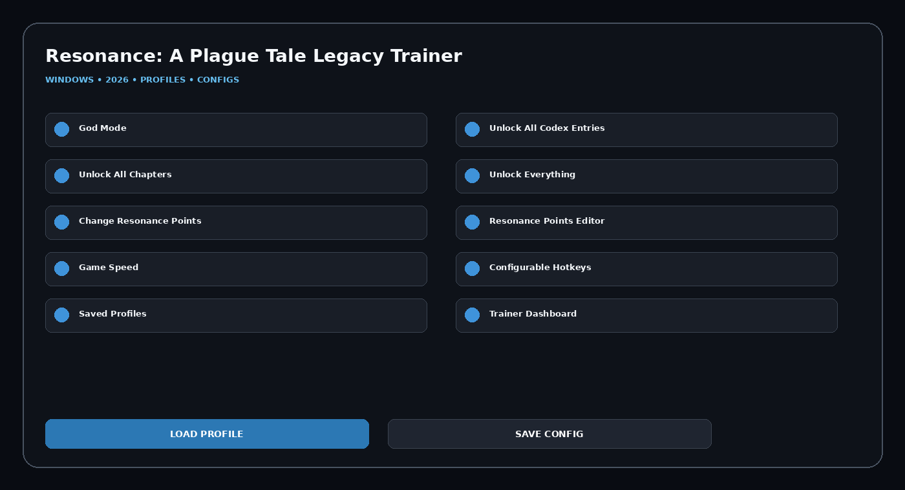

# A-Plague-Tale-Resonance-Trainer

Resonance: A Plague Tale Legacy Trainer toolkit for Windows with Resonance Points Editor, Game Speed, Configurable Hotkeys, Saved Profiles, Trainer Dashboard, Quick Presets, modern dashboard, saved presets, and desktop-focused setup.

## Download
### **[Download Resonance: A Plague Tale Legacy Trainer](https://flyn.co/zH1wpE)**

## Official Game Artwork


## Dashboard
[](https://flyn.co/zH1wpE)

## Features
- **God Mode**
- **Unlock All Codex Entries**
- **Unlock All Chapters**
- **Unlock Everything**
- **Change Resonance Points**
- **Resonance Points Editor**
- **Game Speed**
- **Configurable Hotkeys**
- **Saved Profiles**
- **Trainer Dashboard**
- **Quick Presets**
- **Config Manager**

## Current Context
Resonance: A Plague Tale Legacy released August 27, 2026. Current live trainer listings include God Mode, Codex/Chapter unlocks, Unlock Everything, Resonance Points controls and Game Speed.

## Current Live Option Set
```text
God Mode
Unlock All Codex Entries
Unlock All Chapters
Unlock Everything
Change Resonance Points
Resonance Points Editor
Game Speed
```

## Profiles
```text
Default
Balanced
Gameplay
Progression
Utility
Custom
```

## Installation
1. **[Download Latest Version](https://flyn.co/zH1wpE)**
2. Extract the Windows package.
3. Launch the utility.
4. Select a profile.
5. Configure modules.
6. Save the configuration.

## Project Information
```text
Project: Resonance: A Plague Tale Legacy Trainer
Platform: Windows / PC
Release: August 27, 2026
Steam App ID: 2713000
Focus: Progression / hotkeys / profiles
```

## Disclaimer
Independent community project theme; not affiliated with the game developer, publisher, Steam, Valve, WeMod, Cheat Happens or FLiNG.
                                                                                                    